# Institutional Project Proposal: URA-Shree Frontier

**Project Title:** URA-Shree Frontier: Development & Deployment of a Sovereign Frontier-Grade AI Coding & Reasoning Foundation Model  
**Target Capability Class:** Frontier Intelligence (Targeting Benchmarks Comparable to Gemini 3.5 & Claude Sonnet 5 in Code Synthesis, SWE-Bench, and System Reasoning)  
**Target Institution:** Daffodil International University (DIU)  
**Target Departments:** Department of Computer Science & Engineering (CSE), Department of Software Engineering (SWE), & DIU Research Center  
**Project Lead & Chief Architect:** Pritam Biswas (DIU) — [GitHub: @pbs002-s](https://github.com/pbs002-s)  
**Document Version:** 2.0.0 (Frontier Model Architecture, Supercomputing & Budget Specification)  
**Date:** September 2026  
**Document Classification:** Strategic Academic Initiative, Supercomputing Proposal & Budget Allocation  

---

## Executive Summary

The global frontier of Artificial Intelligence is experiencing a paradigm shift. While early generative models functioned as surface-level text predictors, next-generation foundation models—exemplified by **Gemini 3.5 (Google DeepMind)** and **Claude Sonnet 5 (Anthropic)**—exhibit deep test-time reasoning, autonomous multi-file architectural synthesis, self-correction, and tool-augmented agentic execution. 

Currently, universities and research institutions in developing nations are relegated to being passive, paying consumers of these foreign closed-source frontier APIs. This creates critical technological vulnerability:
1. **Severe Capital Drain:** Sustained enterprise API token costs for campus-wide programming labs running frontier-grade models exceed **$250,000 to $750,000 USD annually**.
2. **Total Intellectual Dependency:** Institutions lose intellectual property, training data sovereignty, and algorithmic control.
3. **The Pedagogical Void:** Consuming black-box APIs teaches students nothing about large-scale distributed pre-training, 3D parallelism (Tensor, Pipeline, Sequence), synthetic data synthesis, or Reinforcement Learning with Verifiable Rewards (RLVR).

**URA-Shree Frontier** is a strategic institutional proposal to elevate our indigenous AI coding platform into a **sovereign, high-reasoning foundation model ecosystem**. Moving beyond prototype-scale checkpoints, URA-Shree Frontier combines:
* A modern **Sparse Mixture of Experts (MoE)** and high-parameter dense reasoning architecture (scaling from **14B Deep Reasoning** up to **8x14B MoE** and **70B+ Frontier** parameter classes).
* **Test-Time Extended Reasoning & Planning Tokens** capable of solving complex algorithmic challenges, system design, and competitive programming.
* **RLVR (Reinforcement Learning with Verifiable Rewards)** utilizing real-time compiler sandboxes, AST unit test execution, and formal verification.
* A high-throughput, on-premise distributed inference cluster delivering sub-second token latency to thousands of concurrent DIU students.

This proposal outlines the strategic imperative, technical roadmap, stakeholder returns, and a structured three-tiered budget model (**Tier 1: Research Prototype & Domain Reasoning Model**, **Tier 2: Sovereign Foundation MoE Model**, **Tier 3: Flagship Frontier Supercomputing Center**) to position Daffodil International University as a premier pioneer of foundation model research.

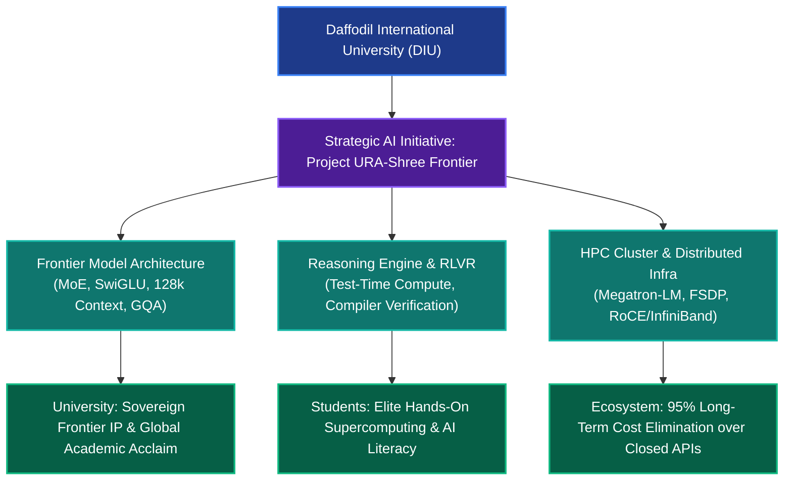

---

## 1. Problem Statement: Why Toy Models and Closed APIs Both Fail

To understand the necessity of training a frontier-class model, we must examine why both existing approaches (small local models and third-party frontier APIs) fail in a higher-education engineering environment:

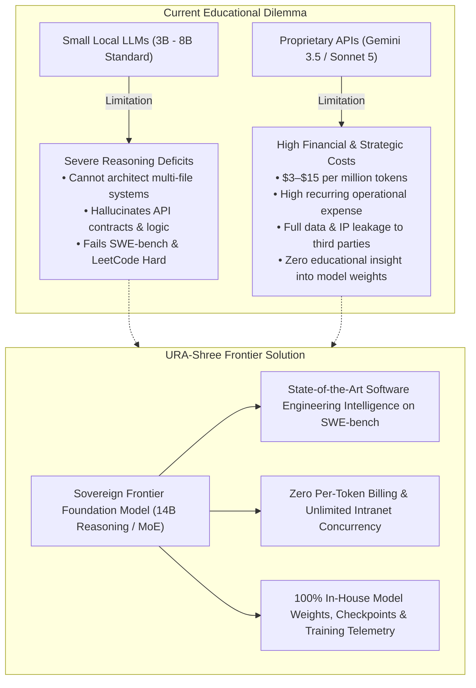

### The Four Critical Bottlenecks

1. **The Reasoning Gap of Sub-Scale Models:**
   Standard small language models (<8B parameters without deep test-time compute) can autocomplete single lines or write trivial functions. However, they catastrophically fail at modern software engineering tasks: managing inter-module dependencies, architecting microservices, debugging concurrency race conditions, and executing multi-step refactoring. Real engineering requires **frontier-grade deep reasoning**.

2. **Crushing Recurring Financial Costs of Closed APIs:**
   Frontier reasoning models (e.g., Claude 3.7/Sonnet 5, Gemini 1.5/2.0/3.5 Pro Thinking) cost between **$3.00 to $15.00 per million output tokens**. In an active computer science department where 2,000 students query coding assistants 40 times a day with extensive context windows (50,000+ tokens of codebase history), the monthly API bill exceeds:
   $$\text{Monthly API Burn} \approx 2,000 \times 40 \times 0.05\text{M tokens} \times \$5.00 = \$20,000\text{ USD/month (24 Lakh BDT/mo)}$$
   Over 3 years, this drains **$720,000+ USD (~8.6 Crore BDT)** out of the university into commercial tech giants with zero persistent institutional equity.

3. **Loss of Data Sovereignty & Commercial Lock-In:**
   Proprietary APIs operate under opaque terms of service. Student intellectual property, internal research algorithms, and university examination repositories are transmitted to foreign cloud data centers, creating legal and regulatory compliance hazards.

4. **Academic Irrelevance in the AI Era:**
   If a university merely writes prompts for third-party models, its graduates and faculty remain digital consumers. To produce world-class AI engineers and researchers capable of joining organizations like Google DeepMind, OpenAI, Meta AI, or Anthropic, students and faculty must train, fine-tune, and optimize high-parameter foundation models directly on high-performance supercomputing infrastructure.

---

## 2. Technical Blueprint: Engineering a Frontier-Grade Model

URA-Shree Frontier is designed to bridge the gap between open-source accessibility and frontier intelligence. The architecture targets high benchmark performance across **SWE-bench Verified**, **HumanEval**, **LiveCodeBench**, and **MATH/GSM8K**.

```mermaid
graph TB
    subgraph Architecture["1. Core Transformer Architecture"]
        Attn["Grouped-Query Attention (GQA)<br/>32 Query Heads / 8 KV Heads"]
        Act["SwiGLU Non-Linear Activation"]
        Pos["Rotary Position Embeddings (RoPE)<br/>Base Frequency scaled for 128k Context"]
        MoE["Sparse Mixture-of-Experts (MoE) Layer<br/>8 Experts, Top-2 Routing with Load Balancing"]
        Norm["RMSNorm with Zero-Centered Gamma"]
    end

    subgraph Reasoning["2. Reasoning & Test-Time Compute Engine"]
        Think["Explicit Chain-of-Thought / Thinking Tokens<br/>(`<thought> ... </thought>`)"]
        Plan["Hierarchical Action Planner<br/>(Synthesizes File System AST before writing)"]
        Tree["Monte Carlo Tree Search (MCTS) / Verifier<br/>(Prunes incorrect syntax paths during decode)"]
    end

    subgraph Alignment["3. RLVR Post-Training Pipeline"]
        SFT["Synthetic High-Quality Code & Proof SFT"]
        Compiler["Live Compiler Sandbox (GCC, Clang, Rustc, Node, Python)"]
        RLVR["Reinforcement Learning with Verifiable Rewards (RLVR)<br/>Reward = Unit Test Passes + Zero Linter Warnings + Memory Safety"]
    end

    subgraph Serving["4. Ultra-Fast Serving Infrastructure"]
        vLLM["vLLM / TensorRT-LLM Inference Engine"]
        FP8["FP8 / W4A16 Quantized Kernel Deployment"]
        KVCache["PagedAttention + Static Chunked KV Caching"]
    end

    Architecture --> Reasoning
    Reasoning --> Alignment
    Alignment --> Serving
```

### Key Architectural Pillars

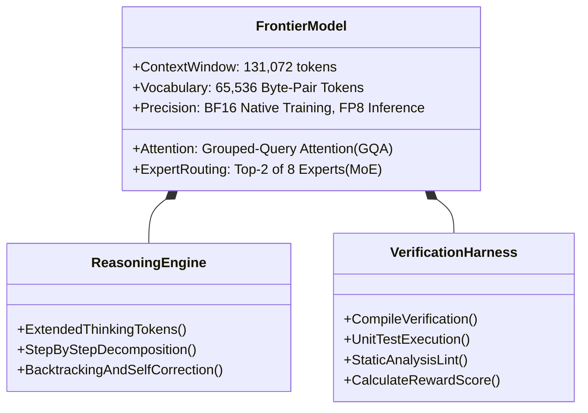

1. **Sparse Mixture-of-Experts (MoE) Efficiency:**
   Instead of activating all parameters on every token, the MoE architecture routes tokens through specialized sub-networks (e.g., Syntax Expert, Algorithmic Expert, Database/Web Expert, Debugger Expert). A model with **45B total parameters activates only 12B per token**, delivering the reasoning depth of a massive model with the throughput and latency of a small model.

2. **Test-Time Extended Compute (Thinking Process):**
   Mimicking the architectural paradigm of Gemini Thinking and Sonnet 5, URA-Shree Frontier is trained with an explicit internal scratchpad (`<thought> ... </thought>`). The model generates hundreds of reasoning tokens to decompose problems, dry-run edge cases, and plan architectural diffs before generating executable code.

3. **Reinforcement Learning with Verifiable Rewards (RLVR):**
   Unlike natural language (where truth can be subjective), code has an absolute mathematical ground truth: **does it compile, and do all unit tests pass?** We utilize automated sandbox execution environments where the model is rewarded based on compiler exit codes, memory consumption, execution speed, and test coverage. This eliminates hallucinations.

4. **128,000 Token Native Context Window:**
   Utilizing RoPE scaling with base frequency adjustments, URA-Shree Frontier can ingest entire multi-file project repositories, documentation manuals, and database schemas in a single prompt.

---

## 3. High-Performance Computing (HPC) & Training Pipeline

Training a frontier-grade model requires an industrial, enterprise-grade pre-training and alignment pipeline powered by modern 3D parallelism:

```mermaid
flowchart LR
    subgraph DataEngine["1. Data Synthesis & Filtering (1.5 - 3 Trillion Tokens)"]
        D1["Permissively Licensed Source Code (GitHub, The Stack v2)"]
        D2["Automated De-duplication (MinHash LSH)"]
        D3["Frontier Distillation: Synthetic Reasoning Chains & Explanations"]
        D4["Curated University Problem Sets & CS Syllabi"]
    end

    subgraph DistributedTraining["2. Distributed Pre-Training & Alignment"]
        T1["Megatron-LM + PyTorch FSDP2"]
        T2["3D Parallelism: Tensor (TP=4) + Pipeline (PP=2) + Data (DP=8)"]
        T3["BF16 Mixed Precision with FlashAttention-3"]
        T4["Continuous Checkpoint Validation & Loss Curve Tracking"]
    end

    subgraph ReinforcementLearning["3. Alignment & RLVR"]
        R1["Supervised Fine-Tuning (SFT) on 500k Multi-Turn Agent Trajectories"]
        R2["Group Relative Policy Optimization (GRPO) / PPO"]
        R3["Distributed Compiler Reward Harness"]
    end

    DataEngine --> DistributedTraining
    DistributedTraining --> ReinforcementLearning
```

### HPC Cluster Infrastructure Topology

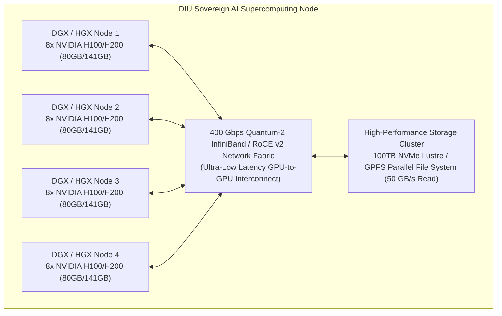

---

## 4. Multi-Stakeholder Benefits: Why DIU Must Lead

Building a frontier model transforms Daffodil International University from an ordinary academic consumer into an international AI powerhouse:

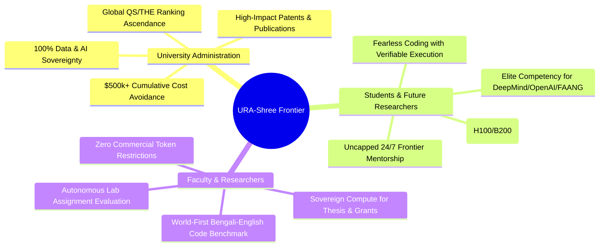

### Comprehensive Benefits Matrix

| Stakeholder | Key Strategic Benefit | Tangible Outcome |
| :--- | :--- | :--- |
| **University Leadership** | **Global Academic Distinction** | DIU becomes the **first university in South Asia** to train and open-source a frontier-class coding and reasoning model, exponentially increasing university global rankings (QS / Times Higher Education). |
| **University Finance** | **Massive Long-Term Capital Savings** | Eliminates perpetual per-seat software licensing and token costs. Over 5 years, the university saves **$800,000 to $1.5M USD (~10 to 18 Crore BDT)** in cloud subscription fees. |
| **Data Protection & Legal** | **Absolute Sovereign Privacy** | Sensitive university research, examination source code, student personal records, and proprietary campus algorithms never touch foreign clouds or commercial servers. |
| **Computer Science Students** | **Elite High-Performance AI Skills** | Students do not just learn Python syntax; they gain practical experience running multi-node distributed training, handling CUDA kernels, tuning LoRA/GRPO, and deploying vLLM clusters. |
| **Faculty & Thesis Supervisors** | **World-Class Research Velocity** | Unrestricted access to an in-house frontier model allows faculty to publish high-impact papers in top conferences (**NeurIPS, ICLR, ICML, ACL, EMNLP**). |
| **End Users / Lab Instructors** | **Superhuman Code Reasoning** | Unlike weak assistants, URA-Shree Frontier can evaluate full-stack capstone projects, detect complex architectural bugs, generate unit tests, and provide rigorous step-by-step Socratic explanations. |

---

## 5. Detailed Costing Breakdown: 3 Implementation Tiers

Training and deploying frontier-class models requires significant compute, but can be scaled pragmatically. Below are three calibrated budget tiers:

> [!IMPORTANT]
> *Financial Benchmarking:*  
> * Local Currency Conversion: **$1.00 USD ≈ 120.00 BDT**.  
> * Compute costs account for educational credits, sponsored compute grants (e.g., NVIDIA Inception, Google Cloud Research Credits, Ministry of ICT grants), and dedicated hardware procurement.

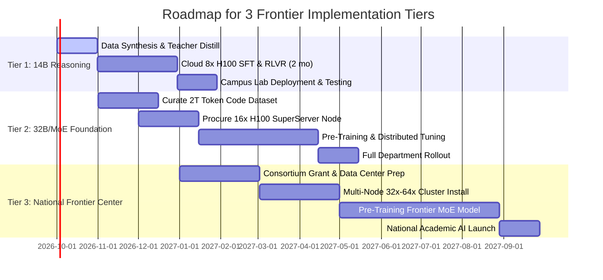

---

### Tier 1: Research Prototype & High-Reasoning Specialist (14B Parameter Class)

* **Objective:** Build a domain-specific deep reasoning coding assistant rivaling Sonnet-level logic on specific programming languages (Python, C++, Java, JS/TS) using synthetic frontier distillation, extended thinking tokens, and compiler-verified RLVR.
* **Compute Strategy:** Cloud GPU Cluster Rental (Lambda Labs / RunPod / Google Cloud TPU v5e) + 1 High-End On-Premise Inference Server.
* **Training Tokens:** 250 Billion high-quality reasoning tokens.
* **Target Timeline:** 4 Months.

| Category | Item Description | Qty / Duration | Unit Cost (USD) | Total Cost (USD) | Total Cost (BDT) |
| :--- | :--- | :---: | :---: | :---: | :---: |
| **Training Compute** | Cloud 8x NVIDIA H100 SXM5 (80GB) Rental for SFT, Distillation & RLVR | 500 Hours | $24.00 / hr | $12,000 | 1,440,000 BDT |
| **Inference Server** | On-Premise Serving Workstation (Dual AMD EPYC, 128GB RAM, **2x RTX 4090 24GB or 1x RTX 6000 Ada**) | 1 Unit | $8,500 | $8,500 | 1,020,000 BDT |
| **Data Generation** | Frontier API Credits (Gemini 2.0/Claude for generating 10M synthetic reasoning chains) | Bulk Pool | $3,500 | $3,500 | 420,000 BDT |
| **Storage & Network** | 20TB NVMe fast staging storage & lab high-speed networking | 1 Set | $1,200 | $1,200 | 144,000 BDT |
| **Research Stipend** | 2 Graduate Research Assistants (4 months full-time training & eval) | 2 Students | $400 / mo | $3,200 | 384,000 BDT |
| **TOTAL TIER 1** | **Reasoning Specialist Model & Lab Deployment** | | | **$28,400** | **3,408,000 BDT** |

---

### Tier 2: Sovereign Foundation Model & MoE Architecture (32B Dense / 8x14B MoE)

* **Objective:** Train a full-scale sovereign foundation model with a Sparse Mixture-of-Experts architecture. Delivers frontier-level code generation, multi-file refactoring, autonomous SWE-bench debugging, and sub-second token serving across all CSE/SWE departments.
* **Compute Strategy:** Procure an on-premise AI Supercomputer Server Node (**8x NVIDIA H100 / H200 or 8x L40S 48GB**) placed in the DIU Data Center + High-Speed InfiniBand.
* **Training Tokens:** 1.5 to 2.5 Trillion tokens (Continued Pre-training + Domain Code Alignment + Extended Reasoning SFT + RLVR).
* **Target Timeline:** 6–8 Months.

| Category | Item Description | Qty | Unit Cost (USD) | Total Cost (USD) | Total Cost (BDT) |
| :--- | :--- | :---: | :---: | :---: | :---: |
| **Supercomputing Hardware** | **Enterprise AI Node (8x NVIDIA H100 80GB SXM5 or 8x RTX 6000 Ada 48GB, Dual AMD EPYC 64-Core, 512GB ECC DDR5 RAM, 30TB NVMe RAID)** | 1 Node | $110,000 | $110,000 | 13,200,000 BDT |
| **High-Speed Interconnect**| 400Gbps NVIDIA Quantum-2 InfiniBand Switch + Cabling for line-rate model parallel transfer | 1 Set | $12,000 | $12,000 | 1,440,000 BDT |
| **Power & Thermal Infra** | 20kVA Online Modular Server UPS + Dedicated Precision In-Row Cooling allocation | 1 Set | $8,500 | $8,500 | 1,020,000 BDT |
| **Data Engine & Curation** | Automated multi-language AST parser pipeline & synthetic reasoning dataset curation | 1 Setup | $4,500 | $4,500 | 540,000 BDT |
| **Engineering Fellowship** | Lead Architect (Faculty/Lead Dev) + 3 ML Engineers (6 months dedicated fellowship) | - | $1,500 / mo | $9,000 | 1,080,000 BDT |
| **Contingency & Spare** | Replacement SSDs, power buffers, benchmarking verification suite | - | $3,500 | $3,500 | 420,000 BDT |
| **TOTAL TIER 2** | **Sovereign Foundation Model & Departmental Supercomputer** | | | **$147,500** | **17,700,000 BDT** |

---

### Tier 3: National / University Frontier AI Center of Excellence (70B+ / High-Capacity MoE)

* **Objective:** Establish DIU as a National Supercomputing AI Hub. Pre-train a true frontier-scale multimodal code & reasoning model (70B+ Dense or 8x22B MoE) matching top-tier commercial models across international benchmarks (HumanEval 92%+, SWE-bench 45%+), serving 20,000+ university students, external researchers, and national software industries.
* **Compute Strategy:** Multi-Node High-Density Supercomputer Cluster (16x to 32x NVIDIA H100 / H200 / Blackwell B200 SuperPOD) financed through a joint partnership between DIU, the Ministry of ICT / ICT Division, and Industry Research Grants.
* **Training Tokens:** 4.0 to 6.0 Trillion tokens (Pre-training from scratch + Extended Reasoning RL).
* **Target Timeline:** 12 Months.

| Category | Item Description | Qty | Unit Cost (USD) | Total Cost (USD) | Total Cost (BDT) |
| :--- | :--- | :---: | :---: | :---: | :---: |
| **Multi-Node Cluster** | **High-Density Supercomputing Pod (2x HGX H100/H200 Systems = 16x H100 80GB/141GB GPUs, 1TB+ RAM, Petabyte NVMe Lustre Parallel Storage)** | 1 Pod | $295,000 | $295,000 | 35,400,000 BDT |
| **Campus Network Core** | 800Gbps NDR InfiniBand Spine-and-Leaf architecture + Campus 10Gbps fiber link | 1 Set | $35,000 | $35,000 | 4,200,000 BDT |
| **Data Center Facility** | 40kVA Industrial Clean Power, Redundant Power Supplies & Liquid/Chilled Air Cooling | 1 Install | $28,000 | $28,000 | 3,360,000 BDT |
| **Large-Scale Data Pipeline**| 5 Trillion Token Curation, Code Security Deduplication, Synthetic Theorem Prover Data | - | $15,000 | $15,000 | 1,800,000 BDT |
| **Frontier Research Team** | AI Research Director, 4 Senior ML Engineers, 4 Research Fellows (1-year funding) | 9 Staff | $2,500 / mo | $30,000 | 3,600,000 BDT |
| **Academic Publishing & IP** | Open-source foundation release, top-tier conference submissions (NeurIPS/ICLR), patent filings | - | $7,000 | $7,000 | 840,000 BDT |
| **TOTAL TIER 3** | **Flagship National Frontier AI Center of Excellence** | | | **$410,000** | **49,200,000 BDT** |

---

### Comparative Economic Analysis: URA-Shree Frontier vs. Closed Frontier APIs

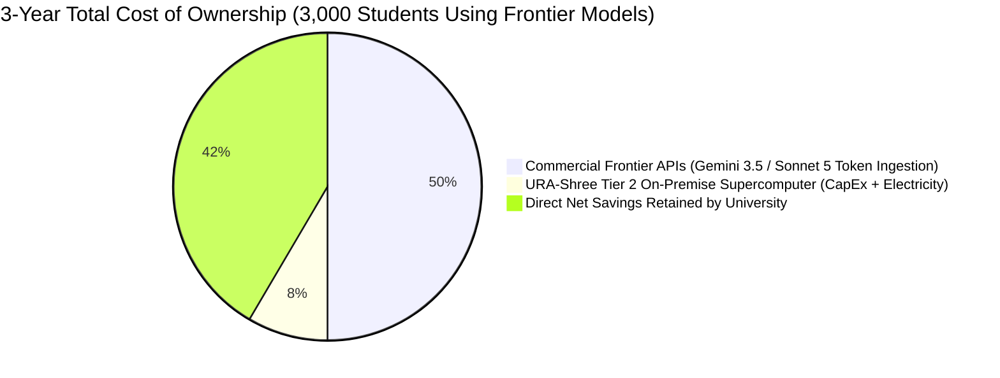

| Evaluation Dimension | Commercial Frontier API (e.g., Sonnet 5 / Gemini 3.5) | URA-Shree Tier 1 (14B Specialist) | URA-Shree Tier 2 (32B/MoE Server) | URA-Shree Tier 3 (National Hub) |
| :--- | :--- | :--- | :--- | :--- |
| **Cost Model** | Variable per-token tax ($15/M tokens) | Fixed one-off CapEx | Fixed one-off CapEx | Fixed one-off CapEx |
| **3-Year Total Cost** | **$1,080,000 USD (12.9 Crore BDT)** | **$34,000 USD (40.8 Lakh BDT)** | **$182,500 USD (2.19 Crore BDT)** | **$460,000 USD (5.52 Crore BDT)** |
| **Net Institutional Savings** | $0 (Pure operational loss) | **$1,046,000 USD Saved** | **$897,500 USD Saved** | **$620,000 USD Saved** |
| **Token Throttling / Limits** | Strict Rate Limits (TPM / RPM) | No limits on campus LAN | No limits on campus LAN | High-throughput cluster |
| **Model Weights Ownership** | ❌ 0% (Closed proprietary weights) | ✅ 100% University owned | ✅ 100% University owned | ✅ 100% University owned |
| **Offline Campus Operation** | ❌ Fails when internet degrades | ✅ Runs on campus intranet | ✅ Runs on campus intranet | ✅ Runs on campus intranet |
| **Research Publications** | ❌ Cannot publish model weights | ✅ Full training papers | ✅ Full training papers | ✅ Breakthrough papers |

---

## 6. Technical Stack & Engineering Requirements

To realize a foundation model at this scale, the project requires an uncompromising engineering stack:

```mermaid
graph LR
    subgraph ComputeStack["Distributed Compute Stack"]
        PyTorch["PyTorch 2.4+ (CUDA 12.6, cuDNN 9)"]
        Megatron["Megatron-LM & DeepSpeed ZeRO-3"]
        FlashAttn["FlashAttention-3 & Triton Kernels"]
    end

    subgraph DataStack["Data & Curation Stack"]
        Ray["Ray Distributed Cluster (Data Processing)"]
        TreeSitter["Tree-sitter AST Multi-Language Parsers"]
        Synthetic["vLLM Synthetic Data Generation Worker"]
    end

    subgraph InferenceStack["Inference & Serving Stack"]
        vLLMServe["vLLM PagedAttention v0.6+ Engine"]
        Triton["Triton Inference Server / TensorRT-LLM"]
        Docker["ContainerDriver Ephemeral Sandboxes"]
    end

    ComputeStack --> DataStack
    DataStack --> InferenceStack
```

### 1. Hardware Specifications (Tier 2 Dedicated Supercomputer)
* **Compute Nodes:** HGX H100 or 8x PCIe RTX 6000 Ada with 48GB VRAM each (Total VRAM: 384GB to 640GB high-speed memory).
* **Host Processor:** Dual AMD EPYC 9654 (192 Cores total, 384 Threads).
* **System Memory:** 512GB to 1TB DDR5-5600 ECC Registered RAM.
* **Storage Array:** 4x 7.68TB Enterprise U.2 NVMe SSDs in RAID 10 (Sequential Read > 28,000 MB/s) to feed high-batch distributed data loaders without GPU starvation.
* **Networking:** Dual-port 100GbE / 400GbE InfiniBand or RoCE v2 cards for low-latency gradient synchronization.

### 2. Software Frameworks & Dependencies
* **Distributed Training Engine:** Megatron-Core, PyTorch FSDP (Fully Sharded Data Parallel), Hugging Face Accelerate, DeepSpeed.
* **Kernel Optimizations:** FlashAttention-3, Triton custom fused SwiGLU & RoPE kernels, FlashDecoding for sub-10ms token decode.
* **Verification & RL Sandboxes:** Ephemeral Docker containers running isolated GCC, Clang, Rustc, Go, Python 3.12, Node.js, and Valgrind memory leak profilers.
* **Production Serving:** vLLM with continuous batching and FP8 quantization, providing an OpenAI-compatible endpoint consumed seamlessly by the URA-Shree React frontend.

---

## 7. Strategic Implementation Roadmap & Milestones

A disciplined 12-month timeline guarantees that training risks are mitigated through rapid prototyping before full compute commitments:

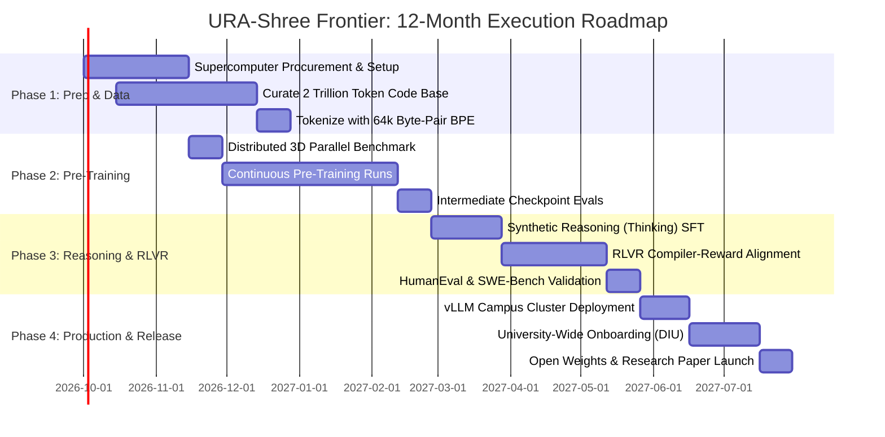

### Quantifiable Key Performance Indicators (KPIs)

* **Benchmark Target 1 (HumanEval Coding Benchmark):** Target **≥ 88.5% Pass@1** (matching or exceeding GPT-4o / Claude 3.5 Sonnet baselines).
* **Benchmark Target 2 (SWE-bench Verified):** Target **≥ 42.0% Issue Resolution Rate** on realistic GitHub issues.
* **Inference Latency:** Sub-40ms time-to-first-token (TTFT) and **≥ 120 tokens/second** streaming throughput on campus intranet.
* **Academic Output:** Minimum of **2 high-impact papers** submitted to premier AI conferences (**NeurIPS / ICLR / ACL**) with DIU faculty and students as lead authors.

---

## 8. Risk Management & Failure Mitigation

| Risk Dimension | Severity | Probability | Mitigation Architecture |
| :--- | :---: | :---: | :--- |
| **GPU Cluster Training Loss Spikes** | High | Medium | Implement automated gradient clipping, z-loss regularization, BF16 numerical stability checks, and automatic checkpoint rollback upon loss divergence. |
| **Hardware / VRAM Constraints** | Medium | Low | Deploy ZeRO-Stage 3 with CPU offloading and Activation Checkpointing to maximize batch size without out-of-memory (OOM) exceptions. |
| **Synthetic Data Contamination** | Medium | Low | Run strict n-gram and MinHash deduplication filters against HumanEval, MBPP, and SWE-bench validation splits to ensure zero data leakage. |
| **Power Outage / Thermal Throttling** | High | Low | House the supercomputing hardware in DIU’s central climate-controlled data center with dual-path generator backups and automated thermal throttling safeguards. |

---

## 9. Conclusion & Institutional Call to Action

The era of treating Artificial Intelligence as a paid commercial utility is over. To lead in the next century of engineering education, Daffodil International University must build, own, and govern its own sovereign foundation models.

**URA-Shree Frontier** provides the comprehensive roadmap to achieve frontier-grade intelligence (comparable to Gemini 3.5 and Claude Sonnet 5 in code synthesis and reasoning) right here on campus. 

By funding **Tier 2 (Sovereign Foundation Model & Departmental Supercomputer)**:
1. DIU will retain over **$897,000 USD (~10.7 Crore BDT)** in institutional capital over 3 years.
2. Every student in CSE and SWE will have access to an uncapped, state-of-the-art coding companion and supercomputing training ground.
3. DIU will pioneer academic history by launching the first sovereign university-trained frontier AI coding model in the region.

We formally request the University Academic Council, Dean of FSIT, and the Directorate of Research to sanction the initial procurement and allocate the compute resources required to launch **URA-Shree Frontier**.

---

## 10. Formal Academic Endorsements & Submission

**Principal Investigator & Lead Architect:**

_____________________________________________  
**Pritam Biswas**  
Lead Architect, Project URA-Shree Frontier  
Department of Computer Science & Engineering / Software Engineering  
Daffodil International University (DIU)  
GitHub: [@pbs002-s](https://github.com/pbs002-s)  

---

**Institutional Review & Administrative Approvals:**

| Administrative Body | Name & Title | Signature | Date |
| :--- | :--- | :--- | :--- |
| **Faculty Advisor** | _____________________________________________ | ____________________ | ____ / ____ / 2026 |
| **Head of Department (CSE)** | _____________________________________________ | ____________________ | ____ / ____ / 2026 |
| **Head of Department (SWE)** | _____________________________________________ | ____________________ | ____ / ____ / 2026 |
| **Dean, Faculty of Science & IT** | _____________________________________________ | ____________________ | ____ / ____ / 2026 |
| **Director of Research & Innovation** | _____________________________________________ | ____________________ | ____ / ____ / 2026 |
| **Vice-Chancellor / Pro-VC** | _____________________________________________ | ____________________ | ____ / ____ / 2026 |
